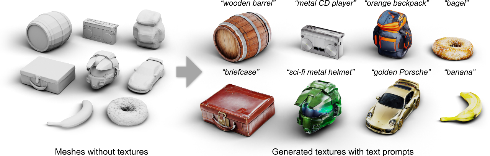

# Text2Tex: Text-driven Texture Synthesis via Diffusion Models

## Introduction

We present Text2Tex, a novel method for generating high-quality textures for 3D meshes from the given text prompts. Our method incorporates inpainting into a pre-trained depth-aware image diffusion model to progressively synthesize high resolution partial textures from multiple viewpoints. To avoid accumulating inconsistent and stretched artifacts across views, we dynamically segment the rendered view into a generation mask, which represents the generation status of each visible texel. This partitioned view representation guides the depth-aware inpainting model to generate and update partial textures for the corresponding regions. Furthermore, we propose an automatic view sequence generation scheme to determine the next best view for updating the partial texture. Extensive experiments demonstrate that our method significantly outperforms the existing text-driven approaches and GAN-based methods.

Please also check out the project website [here](https://daveredrum.github.io/Text2Tex/).

For additional detail, please see the ScanRefer paper:  
"[Text2Tex: Text-driven Texture Synthesis via Diffusion Models]()"  
by [Dave Zhenyu Chen](https://www.niessnerlab.org/members/zhenyu_chen/profile.html), [Yawar Siddiqui](https://niessnerlab.org/members/yawar_siddiqui/profile.html),
[Hsin-Ying Lee](https://research.snap.com/team/team-member.html#hsin-ying-lee),
[Sergey Tulyakov](https://research.snap.com/team/team-member.html#sergey-tulyakov), and [Matthias Nießner](https://www.niessnerlab.org/members/matthias_niessner/profile.html)  
from [Technical University of Munich](https://www.tum.de/en/) and [Snap Research](https://research.snap.com/).

## Coming Soon!
